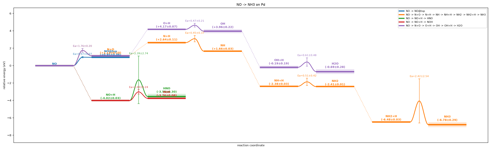
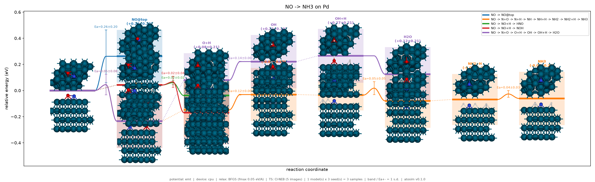
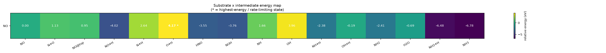
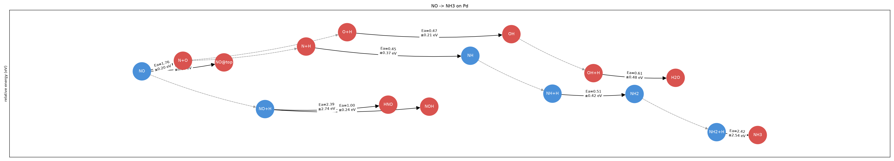
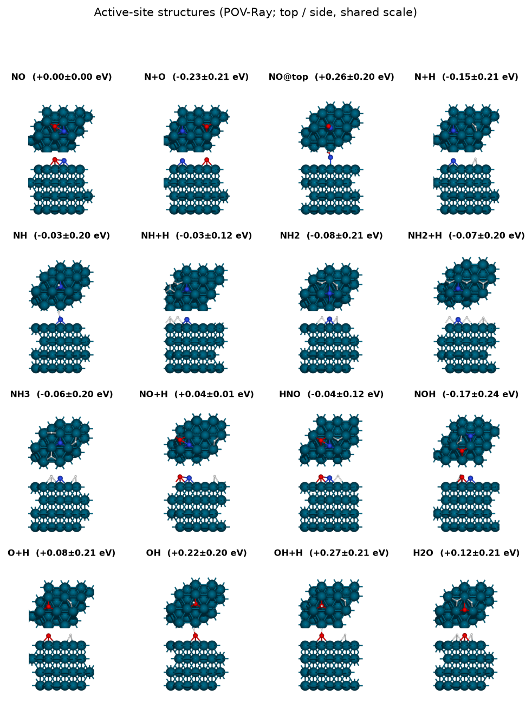
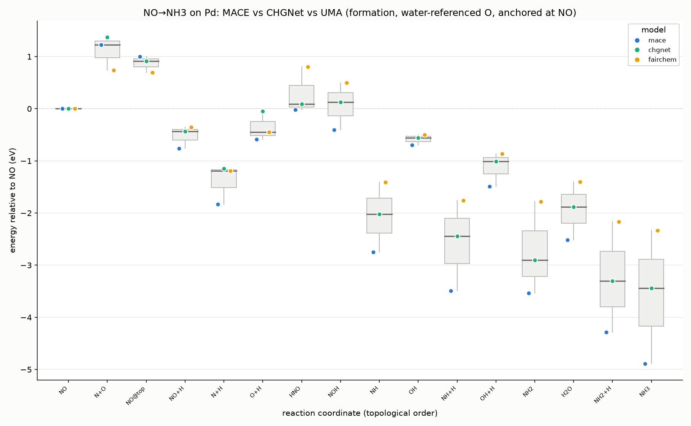
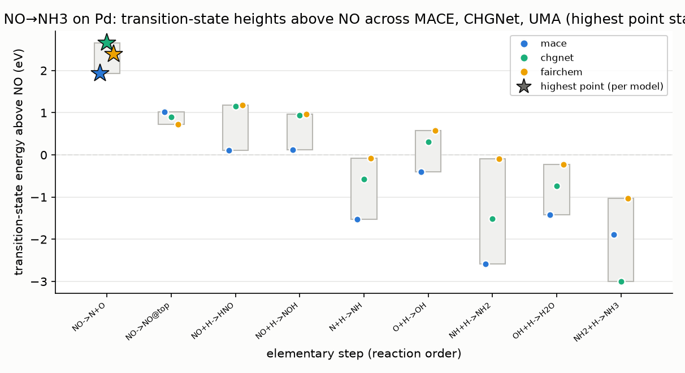

# Gallery

Every figure is a real output, with the exact command that produced it. Drop
`--backend mace` (or use `--backend emt`) to reproduce any of these qualitatively
with no ML install; add `pip install "catpath[mace]"` for the real numbers.

---

## Reaction energy profile

Species as labelled level lines, transition states as barrier bumps (with Ea),
competing pathways in colour, ± uncertainty bands. `graph.png` from any run.

```bash
catpath run examples/no_to_nh3_pd_multimodel.yaml   # MACE, 2 models × 2 seeds
```



The same profile with active-site **structure thumbnails** at each state
(`graph_thumbs.png`):



## Substrate × intermediate energy map

Heatmap of every intermediate's energy; ★ marks the rate-limiting state
(`energy_map.png`, same run).



## Reaction network (DAG)

The branching network as a graph — nodes are states, edges are elementary steps
(`graph_network.png`, same run).



## Active-site structure gallery

Top + side views of every intermediate on a shared camera/zoom. Ray-traced with
`render.backend: povray` (falls back to flat matplotlib circles if `povray`
isn't installed).

```bash
catpath run examples/render_povray.yaml   # -> runs/<name>/gallery.png
```



---

## Cross-model comparison

Run the same network under several ML potentials (each in its own environment),
then `compare` the JSONs — see [`../examples/README.md`](../examples/README.md).

**Intermediate formation energies** — one box per state, dots per model, anchored
at the substrate. State energies are referenced to per-element gas-phase chemical
potentials computed *in each potential*, so composition-changing states compare:

```bash
catpath states examples/no_to_nh3_pd.yaml --backend mace     --out s_mace.json
catpath states examples/no_to_nh3_pd.yaml --backend chgnet   --out s_chgnet.json
catpath states examples/no_to_nh3_pd.yaml --backend fairchem --out s_uma.json
catpath compare --states s_*.json --out models_intermediates.png
```



**Transition-state heights** — each model's highest point (the rate-limiting TS)
is starred; models can disagree on where the bottleneck sits:

```bash
catpath barriers examples/no_to_nh3_pd.yaml --backend mace   --out b_mace.json
catpath barriers examples/no_to_nh3_pd.yaml --backend chgnet --out b_chgnet.json
catpath compare --states b_*.json --heights s_*.json --out models_ts_heights.png
```


